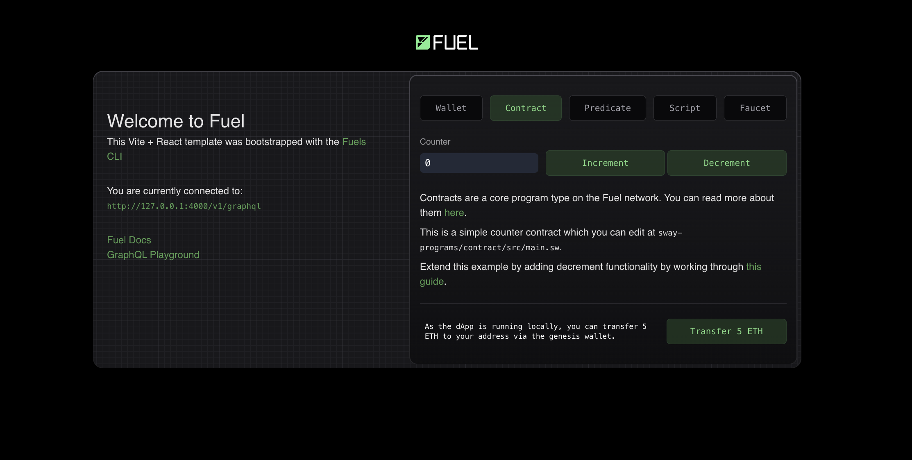

# Creating a Fuel dApp

`npm create fuels` is a command line tool that helps you scaffold a new full-stack Fuel dApp. In this guide, we will create a new counter dApp using `npm create fuels` and add decrement functionality to it. The final result will look like this:



## Initializing the project

The first step is to run the command:

::: code-group

```sh [npm]
npm create fuels
```

```sh [pnpm]
pnpm create fuels
```

:::

Once you run the command, you will be greeted with a few simple questions. We will answer them as follows:

```md
◇ What is the name of your project?
│ my-fuel-project
│
◇ Select a package manager:
│ pnpm
│
◆ Which Sway programs do you want? (space to toggle)
│ ● Contract
│ ○ Predicate
│ ○ Script
└
```

The tool will scaffold the project and install the necessary dependencies for you. You will then be greeted with this message:

```md
⚡️ Success! Created a fullstack Fuel dapp at my-fuel-project

To get started:

- cd into the project directory: cd my-fuel-project
- Start a local Fuel dev server: pnpm fuels:dev
- Run the frontend: pnpm dev

-> TS SDK docs: https://docs.fuel.network/docs/fuels-ts/
-> Sway docs: https://docs.fuel.network/docs/sway/
-> If you have any questions, check the Fuel forum: https://forum.fuel.network/
```

## Directory Structure

The project scaffolded by `npm create fuels` has roughly the following directory structure:

```md
my-fuel-project
├── src
│ ├── pages
│ │ ├── index.tsx
│ │ └── ...
│ ├── components
│ │ └── ...
│ ├── styles
│ │ └── ...
│ └── lib.ts
├── public
│ └── ...
├── sway-programs
│ ├── contract
│ │ └── src
│ │ └── main.sw
│ ├── Forc.lock
│ └── Forc.toml
├── fuels.config.ts
├── package.json
└── ...
```

It is a Next.js project with a few extra files and folders. Let's take a closer look at some of the important ones:

### `./fuels.config.ts`

This is the configuration file for the [`fuels` CLI](./guide/fuels/index.md), the CLI and tooling that powers this project under the hood. It makes sure that all of your Sway programs are continuously compiled and deployed to your local Fuel node. You can read more about the `fuels.config.ts` file in the [Fuels CLI documentation](./guide/fuels/config-file.md).

### `./sway-programs/contract/src/main.sw`

This is where our Sway contract lives. Out of the box, it is a simple counter contract that can only be incremented. We will add a decrement functionality to it in the next step.

### `./src/pages/index.tsx`

This file contains the source code for the frontend of our dApp. It is a Next.js page that renders the counter value and allows the user to increment the counter.

### Dev Environment Setup

Now that we have our project scaffolded, let's set up our development environment.

Let's first start our Fuel Dev server. This will start a local Fuel node and continuously compile and deploy our Sway programs to it.

::: code-group

```sh [npm]
pnpm fuels:dev
```

```sh [pnpm]
pnpm fuels:dev
```

:::

Once the server is up and running, we can start our Next.js development server in another terminal.

::: code-group

```sh [npm]
pnpm dev
```

```sh [pnpm]
pnpm dev
```

:::

You should now be able to see the counter dApp running at `http://localhost:3000`. You can try changing the contents of the `./sway-programs/contract/src/main.sw` file and see the changes reflected in the UI without having to restart the server.


## Adding Decrement Functionality

To add decrement functionality to our counter, we will have to do two things: 1. Add a `decrement_counter` function to our Sway contract, and 2. Modify the `./src/pages/index.tsx` file to add a button that calls this function.

### 1. Modifying the Sway Contract

To add a `decrement_counter` function to our Sway contract, we will modify the `./sway-programs/contract/src/main.sw` file.

There are two steps when adding a new function to a Sway program. The first step is to specify the function's ABI.

Towards the top of the file, you will find the ABI section for the contract. Let's add a new function to it:

<<< @/../../create-fuels-counter-guide/sway-programs/contract/src/main.sw#create-fuels-counter-guide-abi{rust:line-numbers}

The second step is to implement the function.

We will add the implementation of the `decrement_counter` function right below the `increment_counter` function.

<<< @/../../create-fuels-counter-guide/sway-programs/contract/src/main.sw#create-fuels-counter-guide-impl{rust:line-numbers}

### 2. Modifying the Frontend

We will now add a new button to the frontend that will call the `decrement_counter` function when clicked. To do this, we will modify the `./src/pages/index.tsx` file.

First, we will add a function called `onDecrementPressed` similar to the `onIncrementPressed` function:

<<< @/../../create-fuels-counter-guide/src/pages/index.tsx#create-fuels-counter-guide-on-decrement-react-function{ts:line-numbers}

Second, we will add a new button to the UI that will call the `onDecrementPressed` function when clicked:

<!-- TODO: our docs engine currently does not detect comments in JSX -->

```tsx
<Button onClick={onDecrementPressed} className="mt-6">
  Decrement Counter
</Button>
```

Congratulations! That's all. You should now be able to see the counter dApp running at `http://localhost:3000` with our newly added decrement functionality.

You can find the complete source code of the dApp we built [here](https://github.com/FuelLabs/fuels-ts/tree/master/apps/create-fuels-counter-guide).


Whenever you want to add a new feature to your dApp and quickly prototype things, you can follow the same steps we followed in this guide.

## Next Steps

- Now that you have a basic counter dApp running and have the `npm create fuels` workflow powering you, you can start building more complex dApps using the Fuel Stack. A good place to start for ideas and reference code is the [Sway Applications Repo](https://github.com/FuelLabs/sway-applications).

- If you have any questions or need help, feel free to reach out to us on the [Official Fuel Forum](https://forum.fuel.network/).

- If you want to learn more about the Fuel Stack, check out the [Fuel Docs](https://docs.fuel.network/).
