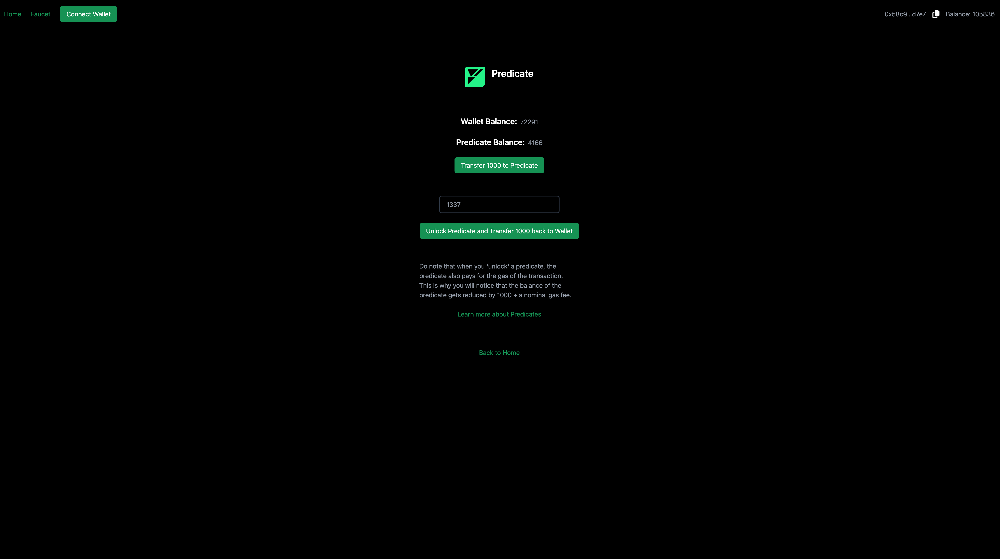

# Creating a Fuel dApp with Predicates

This guide builds on the [Creating a Fuel dApp](./index.md) guide. Once you've gotten the dApp there up and running, then you can continue here via clicking the Predicate Example link. We will modify the predicate we created in the previous guide. The final result will look like this:



## Adding a Configurable pin

The current predicate functionality we have is a simple one that checks if the user has a pin. We will modify this predicate to accept a configurable pin. This will allow the user to set their own pin.

1. Modifying the Predicate Contract

The first step is to modify the predicate contract to accept a configurable pin. We will use the [`configurable`](https://docs.fuel.network/guides/intro-to-predicates/configurables/#configurables) keyword to create an updatable constant to store the pin. We will also modify the main function to check this constant instead of a hardcoded pin.

<<< @/../../docs-snippets/test/fixtures/forc-projects/configurable-pin/src/main.sw#predicate-with-configurable-pin-1{rust:line-numbers}

2. Modifying the Frontend

We will now a new button to the frontend that will update the `pin` in the predicate when clicked. To do this, we will modify the `./src/pages/predicate.tsx` file.

Firstly, we will add a function called `changePin`, which will use the current pin in state to update the pin in the predicate as well as transfer 1000 to the predicate.

<<< @/../../create-fuels-counter-guide/src/pages/predicate.tsx#change-pin-react-function{ts:line-numbers}

It would also be useful to change the placeholder text to say "Enter a new pin" instead of "Hint - the correct pin is 1337".

```tsx
  <Input
        className="w-[300px] mt-8"
        value={pin as string}
        onChange={(e) => setPin(e.target.value)}
        placeholder="Enter a new pin"
      />
```

:::

**Note** If we had wanted to create a completely new Predicate and deploy it to the same address, we could have done it as follows:

---
<<< @/../../docs-snippets/src/guide/predicates/using-predicates.test.ts#predicate-with-configurable-pin-2{ts:line-numbers}

Thirdly, we will add a button that calls the `changePin` function when clicked.

```tsx
  <Button onClick={changePin}>Change Pin</Button>
```

Congratulations! That's all. You should now be able to see the modified predicate dApp running at `http://localhost:3000` with our newly added change pin functionality.

You can find the complete source code of the dApp we built [here](https://github.com/FuelLabs/fuels-ts/tree/master/apps/create-fuels-counter-guide/src/predicate.tsx)..

## Next Steps

- Now that you have a predicate dApp running and have the `npm create fuels` workflow powering you, you can start building more complex dApps using the Fuel Stack. A good place to start for ideas and reference code is the [Sway Applications Repo](https://github.com/FuelLabs/sway-applications).

- If you want to deploy your dApp to the testnet, check out our [Deploying a dApp to Testnet](./deploying-a-dapp-to-testnet.md) guide.

- If you have any questions or need help, feel free to reach out to us on the [Official Fuel Forum](https://forum.fuel.network/).

- If you want to learn more about the Fuel Stack, check out the [Fuel Docs](https://docs.fuel.network/).
