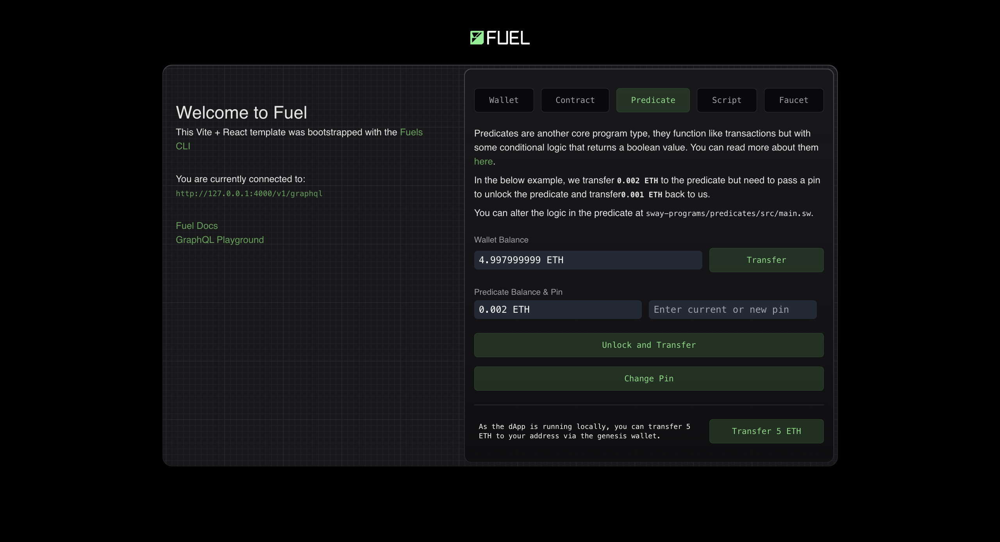

# Working with Predicates

This guide builds on the [Creating a Fuel dApp](./index.md) guide. Once you've gotten the dApp there up and running, then you can continue here via clicking the Predicate Example link. We will modify the predicate we created in the previous guide. The final result will look like this:



You can also check it live, deployed to the Testnet:

- [https://create-fuels-template.vercel.app/](https://create-fuels-template.vercel.app/)

## Adding a Configurable pin

The current predicate functionality we have is a simple one that checks if the user has a pin. We will modify this predicate to accept a configurable pin. This will allow the user to set their own pin.

1. Modifying the Predicate Contract

The first step is to modify the predicate contract to accept a configurable pin. We will use the [`configurable`](https://docs.fuel.network/guides/intro-to-predicates/configurables/#configurables) keyword to create an updatable constant to store the pin. We will also modify the main function to check this constant instead of a hardcoded pin.

<<< @/../../docs-snippets2/sway/configurable-pin/src/main.sw#full{rust:line-numbers}

2. Modifying the Frontend

We will now add new button to the frontend that will update the `pin` in the predicate when clicked. To do this, we will modify the `./src/components/Predicate.tsx` file.

We will add a function called `changePin`, which will use the current pin in state to update the pin in the predicate as well as transfer 1000 to the predicate.

<<< @/../../create-fuels-counter-guide/src/components/Predicate.tsx#change-pin-react-function{ts:line-numbers}

It would also be useful to change the placeholder text.

```tsx
<input
  type="text"
  value={predicatePin}
  onChange={(e) => setPredicatePin(e.target.value)}
  className="w-1/2 bg-gray-800 rounded-md px-2 py-1 mr-3 truncate font-mono"
  placeholder="Enter current or new pin"
/>
```

Finally, we will add a button that calls the `changePin` function when clicked.

```tsx
<Button onClick={changePin} className="w-full" disabled={isLoading}>
  Change Pin
</Button>
```

Congratulations! That's all. You should now be able to see the modified predicate dApp running at `http://localhost:5173` with our newly added change pin functionality.

You can find the complete source code of the dApp we built [here](https://github.com/FuelLabs/fuels-ts/tree/master/apps/create-fuels-counter-guide).

## Next Steps

- Now that you have a predicate dApp running and have the `npm create fuels` workflow powering you, you can start building more complex dApps using the Fuel Stack. A good place to start for ideas and reference code is the [Sway Applications Repo](https://github.com/FuelLabs/sway-applications).

- If you have any questions or need help, feel free to reach out to us on the [Official Fuel Forum](https://forum.fuel.network/).

- If you want to learn more about the Fuel Stack, check out the [Fuel Docs](https://docs.fuel.network/).
