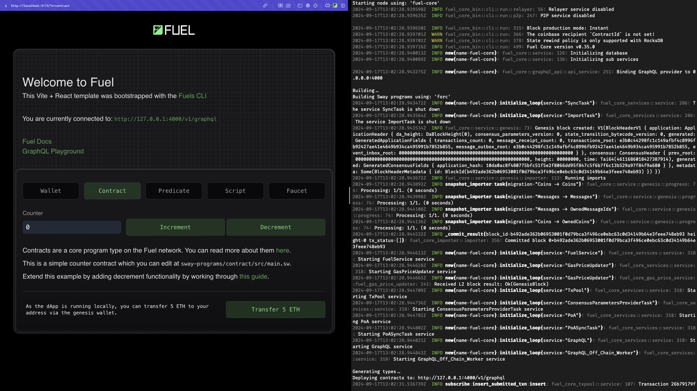

# npm create fuels

`npm create fuels` is a command line tool that helps you scaffold a new full-stack Fuel dApp.

## Getting Started

Run the following command in your terminal to get started:

::: code-group

```sh [npm]
npm create fuels
```

```sh [pnpm]
pnpm create fuels
```

:::

You will be greeted with a few simple questions about your project. Answer them as you see fit.

```md
◇ What is the name of your project?
│ my-fuel-project
│
◇ Select a package manager:
│ pnpm
│
◆ Which Sway programs do you want? (space to toggle)
│ ● Contract
│ ○ Predicate
│ ○ Script
└
```

The tool will then scaffold the project and install the necessary dependencies for you. The project's directory structure will look something like this:

```md
my-fuel-project
├── src
│ ├── pages
│ │ ├── index.tsx
│ │ └── ...
│ ├── components
│ │ └── ...
│ ├── styles
│ │ └── ...
│ └── lib.ts
├── public
│ └── ...
├── sway-programs
│ ├── contract
│ │ └── src
│ │ └── main.sw
│ ├── Forc.lock
│ └── Forc.toml
├── fuels.config.ts
├── package.json
└── ...
```

The most important file in this setup is the `./fuels.config.ts` file, which contains information about your Sway contracts, your local Fuel node, and where your TypeScript types are generated. You can read more about this file in the [Fuels CLI documentation](../fuels/config-file.md).

The `sway-programs` directory contains your Sway programs.

The `src` directory contains your frontend code.

## Running the Project

To run your new full-stack Fuel dApp, you will need to start two processes:

### 1. The `fuels:dev` process

This process will start a local Fuel node on your machine, and keep watch for any changes you make to your Sway smart contracts. Whenever you make a change, the node will automatically rebuild and deploy your contracts to the local Fuel node. It will also automatically keep generating TypeScript types for your contracts, so that you can use them in your frontend code.

To start the `fuels:dev` process, run the following command in your terminal:

::: code-group

```sh [npm]
npm run fuels:dev
```

```sh [pnpm]
pnpm fuels:dev
```

:::

### 2. The Frontend Dev Server

To run your frontend dev server, run the following command in your terminal:

::: code-group

```sh [npm]
npm run dev
```

```sh [pnpm]
pnpm dev
```

:::

Your frontend should now be running at `http://localhost:3000`.

---

You should now have a local full-stack Fuel development environment that looks like this:


