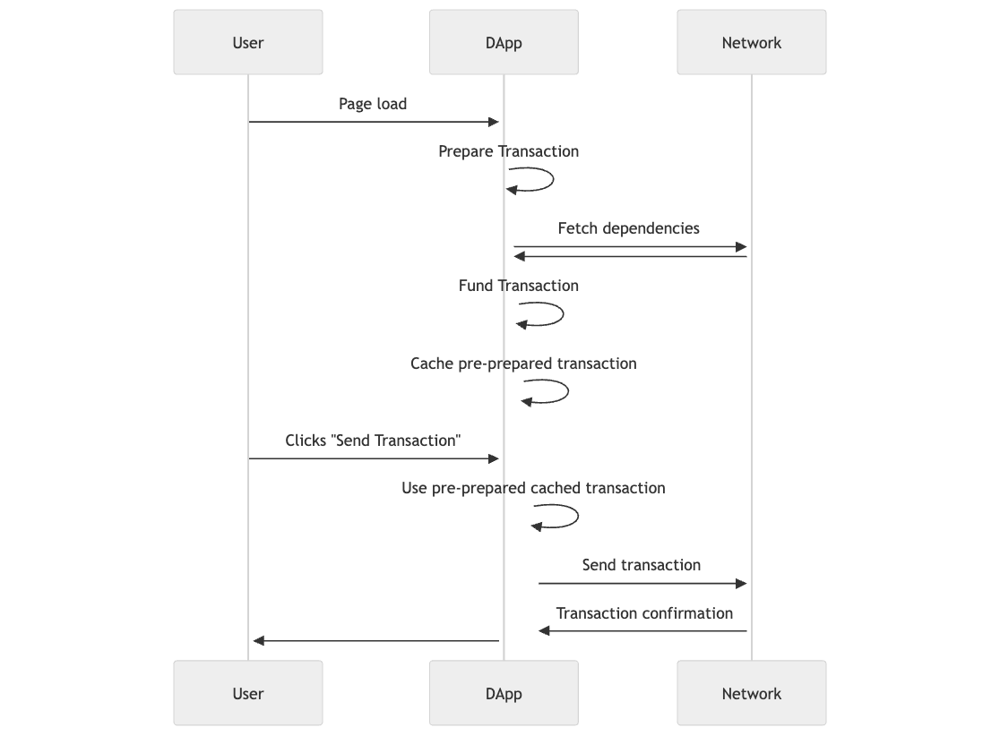
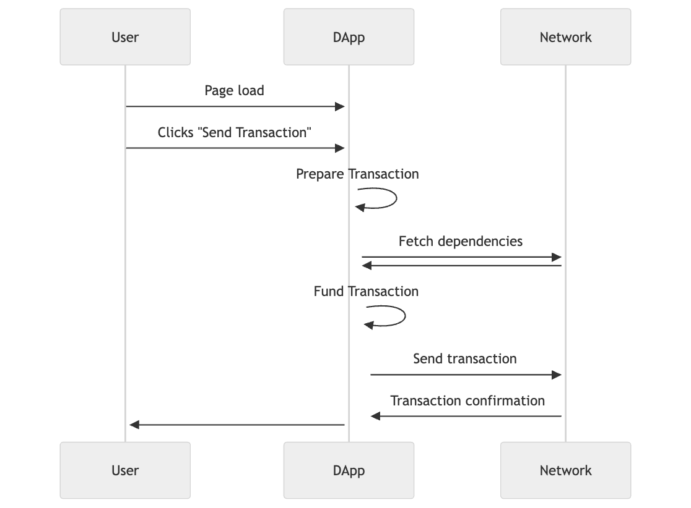

# Optimizing Transactions

When submitting transactions using the SDK, the following actions are being performed:

- Fetching chain information to compute transaction data
- Retrieving the gas price for cost estimation
- Simulating the transaction to obtain missing or estimating transaction data
- Fetching funds for the transaction

Depending on how you are performing the transaction, all of the above may have been abstracted away underneath a single function call that is performing multiple calls to the network to retrieve necessary information. Which gives the appearance of slowness for users interacting with your application.

This process can be illustrated by the following diagram:

This can be mitigated by optimistically building the transaction before your user submits the transaction. Pre-preparation of the transaction can improve the perceived speed of transactions by **~2x**.

The process now looks like the following:

Check out the following guides on implementing optimistic transaction building:

- [Optimistic Transactions](./optimistic-transactions.md)
- [Optimistic Contract Calls](./optimistic-contract-calls.md)
- [Optimistic Predicates](./optimistic-predicates.md)
