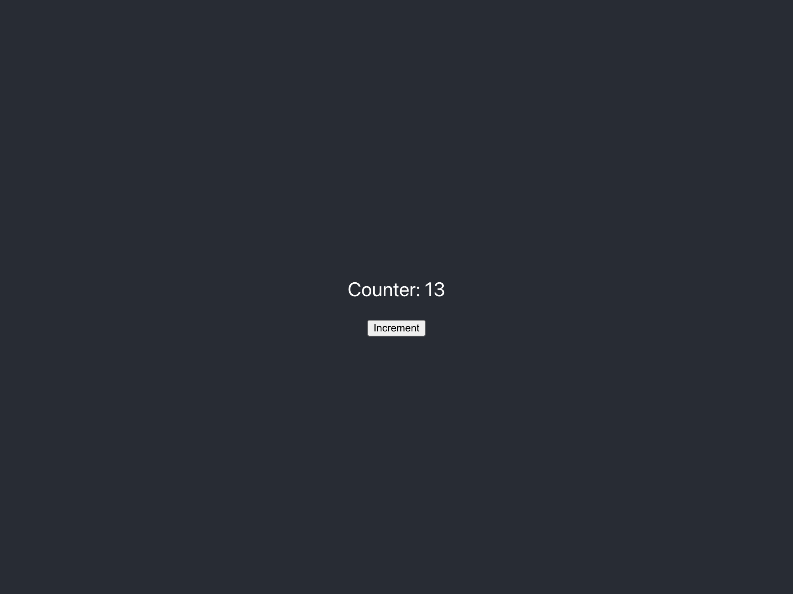

# Quickstart

## Requirements

- [Node.js v18.14.1 or latest stable](https://nodejs.org/en/). We recommend using [nvm](https://github.com/nvm-sh/nvm) to install.

## Introduction

In this tutorial we are going to;

1. 🌴 Install `forc` and the `fuel-core` locally
2. ⚡ Running a Fuel locally
3. 💻 Write & Deploy a **🌴 Sway** Contract
4. 💚 Create a Fuel DApp to interact with your Contract

You can also access the [Example App here](https://github.com/FuelLabs/fuels-ts/tree/master/docs/examples/my-fuel-dapp).

## 🌴 Install `forc` and the `fuel-core` locally

`Forc` is similar to "npm", or "cargo" but for [**🌴 Sway**](https://fuellabs.github.io/sway). `Forc` stands for Fuel Orchestrator. Forc provides a variety of tools and commands for developers working with the Fuel ecosystem, such as scaffolding a new project, formatting, running scripts, deploying contracts, testing contracts, and more. If you're coming from a Rust background, `forc` is similar to cargo.
[read more about Forc](https://fuellabs.github.io/sway/v{{site.data.versions.sway}}/forc/index.html)

`Fuel Core` is the implementation of the `Fuel VM`. `Fuel Core` provides the ability to spin-up a `Fuel Client` locally with custom chain configs. The `Fuel Core` is also used on the live chains, but we are not going to cover it here, as we wan't to focus on development only.
[See more](https://github.com/FuelLabs/fuel-core).

This doc was generated using Fuels `v{{site.data.versions.fuels}}`, Fuel Core `v{{site.data.versions.fuel-core}}`, Sway `v{{site.data.versions.sway}}`, and Forc `v{{site.data.versions.forc}}`.

### MacOS and Linux

When using `MacOS` and `Linux`. We provide a tools [`fuelup`](https://github.com/FuelLabs/fuelup) that works as toolchain manager for Fuel.

#### 1. Install `fuelup`;

```sh
curl --proto '=https' --tlsv1.2 -sSf https://fuellabs.github.io/fuelup/fuelup-init.sh | sh
```

#### 2. Install `forc & fuel-core`

```sh
fuelup toolchain install latest
```

### Windows or other OS

When using `Windows` or installing from source code we also require you to install all cargo toolchain.
[See more instructions here](https://fuellabs.github.io/sway/v0.19.1/introduction/installation.html#installing-from-source).

### Checking environment

To check if `forc` and `fuel-core` are correct installed let's run a version command;

```sh
forc --version
fuel-core --version
```

Both should return the respective versions.

## ⚡ Running a Fuel locally

When developing the best way to test is running a local node, for this we need to;

1. **Create chain configuration**: This file will have the configuration of the root state of the local node. **Like initial account balances**.
2. **Run a local node**: We are going to provide the node process the IP and PORT we want to run it with, and the path to the `chainConfig.json` file we just created.

### 1. Create chain configuration

Let's create a folder for our project.

```sh
mkdir my-fuel-dapp
```

> ⚠️ Notice: All the the commands will have the folder path relative to my-fuel-dapp, in order to know where you should execute things.

Now let's add the root chain configuration. This enables us to initialize the chain with the configs we desire. In our case
let's initialize the `initial_state` with a single known account.

> For this `tutorial` the `known account` will be following: <br />
> PublicKey: `0x94ffcc53b892684acefaebc8a3d4a595e528a8cf664eeb3ef36f1020b0809d0d` <br />
> PrivateKey: `0xa449b1ffee0e2205fa924c6740cc48b3b473aa28587df6dab12abc245d1f5298`

Create a file `my-fuel-dapp/chainConfig.json` with the following content;

```json
{
  "chain_name": "local_testnet",
  "block_production": {
    "ProofOfAuthority": {
      "trigger": "instant"
    }
  },
  "block_gas_limit": 1000000000,
  "parent_network": {
    "type": "LocalTest"
  },
  "initial_state": {
    "coins": [
      {
        "owner": "0x94ffcc53b892684acefaebc8a3d4a595e528a8cf664eeb3ef36f1020b0809d0d",
        "amount": "0x000000000000FFFF",
        "asset_id": "0x0000000000000000000000000000000000000000000000000000000000000000"
      }
    ]
  },
  "transaction_parameters": {
    "contract_max_size": 16777216,
    "max_inputs": 255,
    "max_outputs": 255,
    "max_witnesses": 255,
    "max_gas_per_tx": 100000000,
    "max_script_length": 1048576,
    "max_script_data_length": 1048576,
    "max_static_contracts": 255,
    "max_storage_slots": 255,
    "max_predicate_length": 1048576,
    "max_predicate_data_length": 1048576,
    "gas_price_factor": 1000000
  }
}
```

Notice the `initial_state` is where we configure the initial account balances. In the current config we are setting the account address `0x94ffcc53b892684acefaebc8a3d4a595e528a8cf664eeb3ef36f1020b0809d0d` to have the initial amount `0x000000000000FFFF` and the asset_id to `0x0000000000000000000000000000000000000000000000000000000000000000` which is defined as the NativeAsset.

To learn more about `chainConfig.json`, take a look at the [`fuel-core`](https://github.com/FuelLabs/fuel-core) documentation.

### 2. Run the node

To start the local node we are going to open a new **Terminal Tab/Window**, one important fact is that the process needs to be running
all the time, if you close the terminal/window the node will automatically stop running.

Inside `my-fuel-dapp` run;

```sh
fuel-core run --ip 127.0.0.1 --port 4000 --chain ./chainConfig.json --db-path ./.fueldb
```

Note, that the `--db-path` param defines where the chain state is stored.

You should see the following output:

```sh
INFO new_node: fuel_core::service::graph_api: 72: Binding GraphQL provider to 127.0.0.1:4000
```

#### ✨✨✨ Congrats you have a Fuel DevNode running locally ✨✨✨

<br />

## 💻 Write & Deploy a **🌴 Sway** Contract

Now we are going to;

1. **Create a simple 🌴 Sway contract**
2. **Modify and build**
3. **Deploy the contract**

### 1. Create a simple **🌴 Sway** contract

#### Initialize the **🌴 Sway** project

We are going to use `Forc` to initialize our project. As we already said `forc` includes a template tool to create
a base structure for the project. [Learn more here](https://fuellabs.github.io/sway).

Inside a **new** path `my-fuel-dapp/contract` run:

```sh
forc init ## executes the initialization
```

Now let's **build** the contract initialized by **forc** to make sure we have everything right.

Inside `my-fuel-dapp/contract` run;

```
forc build
```

You should see something like this;

```
Compiled library "core".
Compiled library "std".
Compiled contract "contracts".
Bytecode size is 68 bytes.
```

Congrats! You built your first contract on **🌴 Sway** let's edit and deploy something cooler now.

### 2. Modify and build

Lets change our **🌴 Sway** Contract now, with a slightly more complex example. Read the comments
to help you understand the contract.

For this we are going to update and re-build our contract.

Change the file `my-fuel-dapp/contract/src/main.sw` to:

```rust
contract;

// Storage is the way to add persistent state to our contracts.
//
// For this contract, create a storage variable called `counter` and initialize it to 0.
storage {
    counter: u64 = 0,
}

// Define the interface our contract shall have
abi MyContract {
    // A `counter` method with no parameters that returns the current value of the counter and
    // *only reads* from storage.
    #[storage(read)]
    fn counter() -> u64;

    // An `increment` method that takes a single integer parameter, increments the counter by that
    // parameter, and returns its new value. This method has read/write access to storage.
    #[storage(read, write)]
    fn increment(param: u64) -> u64;
}

// The implementation of the contract's ABI
impl MyContract for Contract {
    #[storage(read)]
    fn counter() -> u64 {
        // Read and return the current value of the counter from storage
        storage.counter
    }

    #[storage(read, write)]
    fn increment(param: u64) -> u64 {
        // Read the current value of the counter from storage, increment the value read by the argument
        // received, and write the new value back to storage.
        storage.counter += param;

        // Return the new value of the counter from storage
        storage.counter
    }
}
```

Now re-build the contract to generate the new binary with changes we just made.

Inside `my-fuel-dapp/contract` run;

```
forc build
```

You should see something like this;

```
Compiled library "core".
Compiled library "std".
Compiled contract "contracts".
Bytecode size is 260 bytes.
```

### 3. Deploy the contract

To deploy the contract we just need to use the `forc-client` plugin with some parameters to inform the node address.

Inside `my-fuel-dapp/contract` run;

```sh
forc deploy --url localhost:4000 --unsigned
```

`--url` sets the URL of the Fuel node to deploy your contract to.
`--unsigned` tells `forc-client` to not sign your transaction.

For more information on `forc-client` and its parameters, visit the [forc client section](https://fuellabs.github.io/sway/master/forc_client.html) in the Sway book.

You should see something like this;

```sh
  Compiled library "core".
  Compiled library "std".
  Compiled contract "contracts".
  Bytecode size is 260 bytes.
Contract id: 0xa326e3472fd4abc417ba43e369f59ea44f8325d42ba6cf71ec4b58123fd8668a
Logs:
TransactionId(HexFormatted(b3e777d3bb5c5bc15ece4e466504f4a2ecc3f5cfdc9c8affac6325ae4d64e2ae))
```

Notice an important thing here; The **`Contract id`** is the address of the deployed contract on the local fuel node. This means in order to interact with the contract the SDK will require us to inform it about the **Contract ID**. In this case `0xa326e3472fd4abc417ba43e369f59ea44f8325d42ba6cf71ec4b58123fd8668a`.

#### ✨✨✨ Congrats you have deployed your first **🌴 Sway** Contract on your own local node. ✨✨✨

## 💚 Create a Fuel DApp to interact with your Contract

Now we are going to;

1. **Initialize a React project.**
2. **Install the `fuels` SDK.**
3. **Modify the App.**
4. **Run our project.**

#### 4.1 Initialize a React project.

To split better our project let's create a new folder `frontend` and initialize our project inside it.

Inside `my-fuel-dapp` run;

```sh
npx create-react-app frontend --template typescript
```

The command will generate a react app using [`Create React App`](https://create-react-app.dev/).

#### 4.2 Install the `fuels` SDK

Now we install the `fuels` umbrella package that includes all the main tools; all the classes such as `Wallet`, `Contracts`, `Providers` and more. Also, it is our utility for ABI TypeScript generation.

> ABI stands for Application Binary Interface. ABI's inform the application the interface to interact with the VM, in other words, they provide info to the APP such as what methods a contract has, what params, types it expects, etc...

##### Install

Inside `my-fuel-dapp/frontend` run;

```sh
npm install fuels --save
```

##### Generating contract types

To make it easier to interact with our contract we use `fuels typegen` to interpret the output ABI JSON from our contract. This JSON was created on the moment we executed the `forc build` to compile our Sway Contract into binary. If you see the folder `my-fuel-dapp/contract/out` you will be able to see the ABI JSON there. If you want to learn more, read the [ABI Specs here](https://github.com/FuelLabs/fuel-specs/blob/master/specs/protocol/abi.md).

Inside `my-fuel-dapp/frontend` run;

```sh
npx fuels typegen -i ../contract/out/debug/*-abi.json -o ./src/contracts
```

You should see something like this:

```sh
$ npx fuels typegen -i ../counter-contract/out/debug/*-abi.json -o ./src/contracts
Generating files..

 - src/contracts/ContractAbi.d.ts
 - src/contracts/factories/ContractAbi__factory.ts
 - src/contracts/index.ts

Done.⚡
```

Now you should be able to find a new folder `my-fuel-dapp/frontend/src/contracts`. This folder was auto-generated by our `fuels typegen` command, this files abstract the work we would need to do, to create a contract instance, and also generate a complete TypeScript interface to the Contract, making easy to develop.

### 3. Modify the App.

Inside the `frontend` folder let's add code that interacts with our contract.
Read the comments to help you understand the App parts.

Change the file `my-fuel-dapp/frontend/src/App.tsx` to:

```ts
import React, { useEffect, useState } from "react";
import { Wallet } from "fuels";
import "./App.css";

// Import the contract factory from the folder generated by the `fuels typegen`
// command
import { ContractAbi__factory } from "./contracts";

// The private key of the `owner` in chainConfig.json.
// This enables us to have an account with an initial balance.
const WALLET_SECRET =
  "0xa449b1ffee0e2205fa924c6740cc48b3b473aa28587df6dab12abc245d1f5298";

// The ID of the contract deployed to our local node.
// The contract ID is displayed when the `forc deploy` command is run.
// E.g. Contract id: 0xa326e3472fd4abc417ba43e369f59ea44f8325d42ba6cf71ec4b58123fd8668a
// const CONTRACT_ID = "0xa326e3472fd4abc417ba43e369f59ea44f8325d42ba6cf71ec4b58123fd8668a"
const CONTRACT_ID =
  "<replace this with the contract id displayed on forc deploy>";

// Create a "Wallet" using the private key above.
const wallet = Wallet.fromPrivateKey(WALLET_SECRET);

// Connect a "Contract" instance using the ID of the deployed contract and the
// wallet above.
const contract = ContractAbi__factory.connect(CONTRACT_ID, wallet);

function App() {
  const [counter, setCounter] = useState(0);

  useEffect(() => {
    async function main() {
      // Executes the `counter()` function to query the current contract state.
      // the `.get()` method is read-only. Therefore, doesn't spend coins.
      const { value } = await contract.functions.counter().get();
      setCounter(Number(value));
    }
    main();
  }, []);

  async function increment() {
    // Creates a transactions to call the `increment()` function, passing in
    // the amount we want to increment. Because we're creating a TX that updates
    // the contract state, this requires the wallet to have enough coins to
    // cover the costs and to sign the transaction.
    const { value } = await contract.functions.increment(1).call();
    setCounter(Number(value));
  }

  return (
    <div className="App">
      <header className="App-header">
        <p>Counter: {counter}</p>
        <button onClick={increment}>Increment</button>
      </header>
    </div>
  );
}

export default App;
```

### 4. Run your project.

Now it's time to have fun run the project on your browser;

Inside `my-fuel-dapp/frontend` run;

```sh
npm start
```

#### ✨💚✨ Congrats you have completed your first DApp on Fuel ✨💚✨


