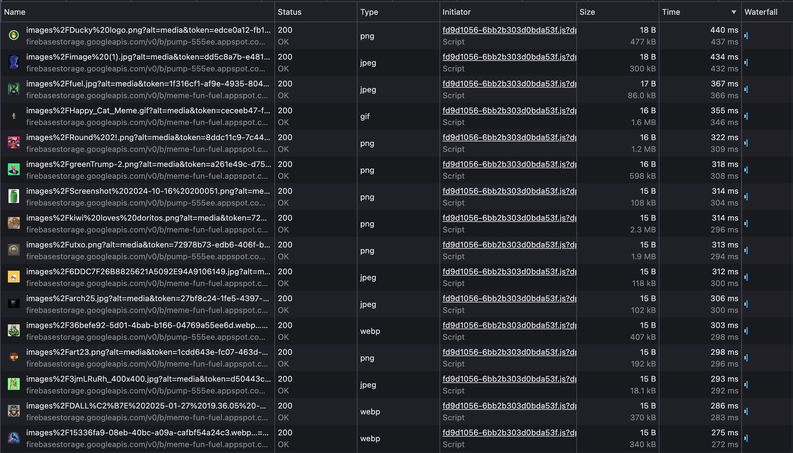
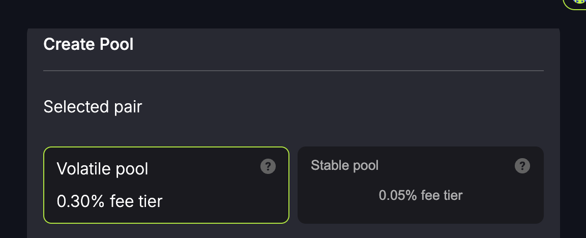

# Mira deep dive

This document takes a deep dive into the [Mira](https://mira.ly/) ecosystem, focusing on improvements that will help optimize the speed and as a result, the user experience.

The following repositories have been considers:
  - [`mira-amm-web`](https://github.com/mira-amm/mira-amm-web)
  - [`mira-v1-ts`](https://github.com/mira-amm/mira-v1-ts)

## Swaps

The swapping logic has the _most_ room for improvement. At a high-level, when initiating a swap for example between `USDT` -> `ETH`, we make multiple single contract calls *mostly sequentially* (37 HTTP requests). This leads to massive request times of up to 3 seconds for the entire swap calculation. This is then requested every 10 seconds to refresh the price.

---

We will look for all the routings for swaps (up to 2 hops away). This will give us a number of pools to swap through. We request all the routable pools with the following query (in [`useGetPoolsWithReserves.ts`](https://github.com/mira-amm/mira-amm-web/blob/8c1cd8cf198fdd7c39ef56c3702d02a6342c2f89/src/hooks/useGetPoolsWithReserve.ts)):

```graphql
query MultiPoolReserve {
  a: poolById(id: $id[0]) {
    ...
  },
  b: poolById(id: $id[1]) {
    ...
  },
}
```

A [`Route`](https://github.com/mira-amm/mira-amm-web/blob/8c1cd8cf198fdd7c39ef56c3702d02a6342c2f89/src/hooks/useGetPoolsWithReserve.ts#L13-L17) looks like the following (so a route can have a number of pools):

```ts
export type Route = {
  pools: Pool[];
  assetIn: CoinData;
  assetOut: CoinData;
};
```

---

For each of the routes, we [construct a swap quote](https://github.com/mira-amm/mira-amm-web/blob/8c1cd8cf198fdd7c39ef56c3702d02a6342c2f89/src/hooks/useSwapRouter.ts#L86), which under the hood, calls the [`mira-v1-ts`](https://github.com/mira-amm/mira-amm-web/blob/8c1cd8cf198fdd7c39ef56c3702d02a6342c2f89/src/hooks/useSwapRouter.ts#L35-L58) (either `previewSwapExactInput` or `previewSwapExactOutput` depending on the direction of the swap).

In the `mira-v1-ts` package, we loop over the pools and construct a single contract call:

- [`previewSwapExactInput`](https://github.com/mira-amm/mira-v1-ts/blob/eae0d9c69785e804b827c4634cbd61f0119eca17/src/sdk/readonly_mira_amm.ts#L206-L213) will call `getAmountsOut`

- [`getAmountsOut`](https://github.com/mira-amm/mira-v1-ts/blob/eae0d9c69785e804b827c4634cbd61f0119eca17/src/sdk/readonly_mira_amm.ts#L144-L173) will:

  - Make a request for the `fees` ([here](https://github.com/mira-amm/mira-v1-ts/blob/eae0d9c69785e804b827c4634cbd61f0119eca17/src/sdk/readonly_mira_amm.ts#L153))
  - Loop over the pools and make an async request for `poolMetadata` ([here](https://github.com/mira-amm/mira-v1-ts/blob/eae0d9c69785e804b827c4634cbd61f0119eca17/src/sdk/readonly_mira_amm.ts#L158-L171))

  ```ts
  for (let poolId of pools) {
    poolId = reorderPoolId(poolId);
    const pool = await this.poolMetadata(poolId);
    // ...
  }
  ```

- [`poolMetadata`](https://github.com/mira-amm/mira-v1-ts/blob/eae0d9c69785e804b827c4634cbd61f0119eca17/src/sdk/readonly_mira_amm.ts#L34-L49) makes the contract call.

```ts
const result = await this.ammContract.functions.pool_metadata(poolIdInput(poolId)).get();
```

### Suggested improvements

1. Allow the `pool_metadata` contract method to receive multiple pool IDs and return all the metadata in a single request.

```ts
// Before
for (let poolId of pools) {
  poolId = reorderPoolId(poolId);
  const pool = await this.poolMetadata(poolId);
  // ...
}

// After
const poolIds = [poolId1, poolId2, ...].map(poolIdInput);
const results = await this.ammContract.functions.pool_metadata(poolIds).get();
```

This would have a significant impact on the number of requests made and the time it takes to get the pool metadata.

If we go down this route, we should also look at making a multi-call for the `fees` contract method.

```ts
// Before
const fees = await this.ammContract.functions.fees().get();
const pools = await this.ammContract.functions.pool_metadata(poolIds).get();

// After
const [fees, ...pools] = await this.ammContract.functions.multiCall([
  this.ammContract.functions.fees(),
  this.ammContract.functions.pool_metadata(poolIds),
]).get();
```

2. If a change to the contract is not possible, then making use of the multi-call would be the next best option.

```ts
// After
const [fees, ...pools] = await this.ammContract.functions.multiCall([
  ...poolIds.map((poolId) => this.ammContract.functions.pool_metadata(poolId)),
]).get();
```

---

The above two solutions will give some significant improvements, however, we can take this one step further by making amendments to the [initial query](https://github.com/mira-amm/mira-amm-web/blob/8c1cd8cf198fdd7c39ef56c3702d02a6342c2f89/src/hooks/useSwapRouter.ts#L82-L96).

Currently, we loop over the routes and make a call with a list of pools. Each iteration will produce a single contract call (assuming the above suggestions are made). With some further amendments to this, we could reduce the current (37 HTTP requests from the example) down to a 2 HTTPs requests:

- One request for the pools
- One request for the pools metadata (fees + metadata)

## Liquidity

> The positions view loads last, however, given this is at the top of the page, should be loaded first IMO.

Suggest to rearrange the load order of the page to put priority on loading the top of the page first.

---

> Unnecessarily large request for [`poolsConnection`](https://github.com/mira-amm/mira-amm-web/blob/e5905c74565b8af0a9f9b141c51c093ec50a2fe6/src/hooks/usePoolsData.ts#L59-L108)

This _could_ be simplified into a smaller query of data, reducing the complexity.

```graphql
query PoolsConnection($first: Int!, $after: String, $orderBy: [PoolOrderByInput!]!, $poolWhereInput: PoolWhereInput) {
  poolsConnection(first: $first, after: $after, orderBy: $orderBy, where: $poolWhereInput ) {
    totalCount
    edges {
        node {
          id
          reserve0Decimal
          reserve1Decimal
          tvlUSD
          asset1 {
            id
            symbol
          }
          asset0 {
            id
            symbol
          }
          snapshots(where: { timestamp_gt: ${timestamp24hAgo} }) {
            volumeUSD
            feesUSD
          }
        }
    }
  }
}
```

---

> Good points

- Both the add liquidity modal and manage liquidity modal seem to be snappy and fast.
- They will be enhanced with the `AssembleTx` endpoint.

## Assets

We currently make a GQL request (to the indexer) for the `AssetList` in [`useAssetList`](https://github.com/mira-amm/mira-amm-web/blob/e5905c74565b8af0a9f9b141c51c093ec50a2fe6/src/hooks/useAssetList.ts):

```graphql
query AssetList {
  assets(where: {numPools_gt: 0}) {
    id
    ...
  }
}
```

---

For each of these assets, we will make an <b>individual</b> GQL request in [`useAssetImage`](https://github.com/mira-amm/mira-amm-web/blob/e5905c74565b8af0a9f9b141c51c093ec50a2fe6/src/hooks/useAssetImage.ts#L7):

```graphql
query AssetImage {
  assetById(id: $id) {
    ...
    image
  }
}
```

---

Some of the asset images returned are currently:

- Missing the cache (namely Firebase images)
- High resolution



### Suggested improvements

> Individual GQL requests for each asset image

We can dynamically build a single GQL request to get all the asset images.

```graphql
query AssetImages($ids: [String!]!) {
  a: assetById(id: $id[0]) {
    ...
  },
  b: assetById(id: $id[1]) {
    ...
  },
  ...
}
```

We could also look at pre fetching (using `fetchQuery` for example) all the asset images as part of the `AssetList` process in [`useAssetList`](https://github.com/mira-amm/mira-amm-web/blob/e5905c74565b8af0a9f9b141c51c093ec50a2fe6/src/hooks/useAssetList.ts).

> Each of the TanStack queries are un-cached.

We can set the `staleTime` to say 1 day, assuming these assets won't change regularly.

> Asset images are high-resolution.

We can look at internally optimizing all images to a more appropriate size. Hosting these would be ideal, like what is done with [psycho duck](https://mira-dex-resources.s3.us-east-1.amazonaws.com/icons/psycho-icon.png)

## Notes

- Bundling `.test` files with the build to [NPM](https://www.npmjs.com/package/mira-v1-ts)
- Misaligned font with the `create-pool` [screen](https://mira.ly/liquidity/create-pool/)
  - 
